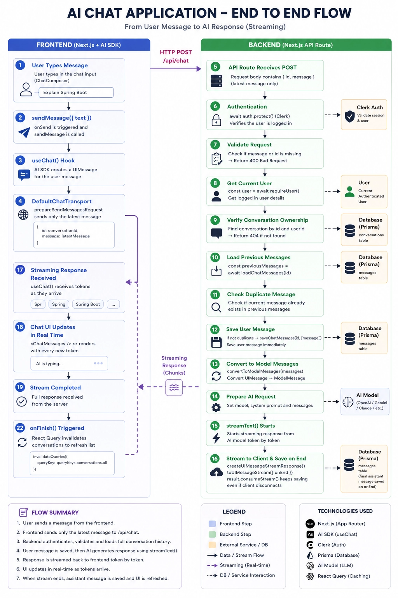
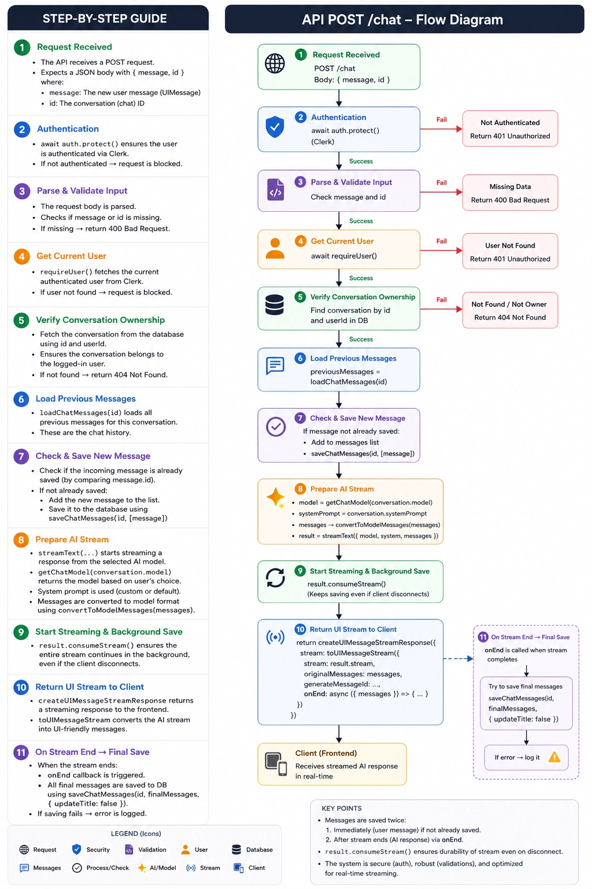

# Kage GPT - Project Summary

## Executive Overview
**Kage GPT** is a modern, full-stack AI chat application built with Next.js 16. It combines a responsive, chat-optimized UI with AI-powered conversations via OpenRouter (OpenAI models), user authentication via Clerk, and persistent data storage using PostgreSQL and Prisma ORM.

The application provides a complete ChatGPT-like experience with conversation management, real-time streaming responses, and a clean, accessible interface powered by shadcn/ui components.

---

## Technology Stack

### Core Framework
- **Next.js 16.2.10** (App Router)
- **React 19.2.4**
- **TypeScript 5**

### Authentication & Security
- **Clerk** — User authentication and session management
- **Middleware** — Protected routes with automatic redirect

### Database & ORM
- **PostgreSQL** — Primary database
- **Prisma 7.8.0** — ORM with migration management
- **Prisma PostgreSQL Adapter** — Connection pooling

### AI & Chat
- **AI SDK (Vercel)** — `ai@7.0.31`, `@ai-sdk/react`, `@ai-sdk/openai`
- **OpenRouter** — Model gateway (default: `openai/gpt-4o-mini`)
- **Streamdown** — Markdown/streaming response rendering with plugins (CJK, Code, Math, Mermaid)

### UI Framework
- **shadcn/ui** — Component library (Base-UI Maia style)
- **Tailwind CSS 4** — Utility-first styling
- **Lucide React** — Icon system
- **TanStack React Query** — Server state management

### State Management
- **React Query** — Data fetching, caching, and mutations
- **AI SDK useChat** — Real-time chat state and streaming
- **Zustand** — Not used; state managed through React Query + AI SDK

### Additional Libraries
- **Sonner** — Toast notifications
- **next-themes** — Dark/light mode support
- **date-fns** — Date formatting (pre-installed)

---

## Core Features

### 1. Authentication & User Management
- Clerk-powered sign-in with redirect
- Automatic user onboarding (`onBoard` server action)
- Protected routes and API endpoints
- User profile linked to Clerk ID in PostgreSQL

### 2. Conversation Management
- **Create, list, rename, pin, archive, and delete** conversations
- Auto-generated titles from first user message
- Pinned conversations appear at top of sidebar
- Real-time sidebar updates via React Query invalidation
- Conversation metadata stored in database

### 3. Real-time Chat
- **Streaming AI responses** with server-sent events
- Markdown rendering with code highlighting and Mermaid diagrams
- **Chat composer** with Enter-to-send and Shift+Enter for newlines
- Loading states and optimistic updates
- Auto-scroll with scroll-to-bottom button
- Download conversation as Markdown file

### 4. Message Persistence
- All messages stored in PostgreSQL with:
  - Role (USER, ASSISTANT, SYSTEM, TOOL)
  - Status (PENDING, COMPLETE, ERROR)
  - Content and structured parts (JSON)
- AI message parts preserved for rich rendering
- Conversation lastMessageAt automatically updated

### 5. UI/UX
- **Responsive design** with mobile sidebar overlay
- Collapsible sidebar with keyboard shortcut (Cmd/Ctrl + B)
- **Dark/light mode** toggle
- Real-time visual feedback (spinners, streaming indicators)
- Empty state messaging
- Theme-aware components

---

## Architecture Overview

### Folder Structure
```
app/                    # Next.js App Router pages
├── (auth)/            # Authentication routes (Clerk sign-in)
├── (root)/            # Main app layout with sidebar
│   ├── c/[id]/        # Individual conversation view
│   └── page.tsx       # Root redirect → create new chat
├── api/chat/          # Chat streaming API endpoint
└── layout.tsx         # Root layout with providers

components/             # Reusable UI components
├── ai-elements/       # AI-specific components (conversation, message)
├── providers/         # React Query, Theme providers
└── ui/                # shadcn/ui components (45+ files)

features/              # Feature-based modules
├── ai/               # AI model utilities, chat store
├── auth/             # Authentication actions
├── conversation/     # Conversation CRUD, components, hooks
├── home/             # Landing/redirect logic
└── messages/         # Message CRUD, hooks

hooks/                 # Custom React hooks
lib/                   # Utilities, Prisma client
prisma/               # Database schema and migrations
public/               # Static assets
```

### Data Flow

```
User sends message
    ↓
ChatComposer → sendMessage (AI SDK)
    ↓
/api/chat (POST)
    ├── Authentication (Clerk)
    ├── Load conversation + previous messages
    ├── Save user message to database
    ├── Stream AI response (OpenRouter via AI SDK)
    ├── Return stream to client
    └── On end: Save assistant response
```


### Server Actions
- **`onBoard`** — Sync Clerk user to local database
- **`requireUser`** — Auth middleware for server actions
- **`listConversations`** — Fetch user's conversations
- **`createConversation`** — New conversation with auto-title
- **`updateConversation`** — Rename, pin, archive
- **`deleteConversation`** — Soft/hard delete
- **`loadChatMessages`** — Load messages for a conversation
- **`saveChatMessages`** — Upsert messages from AI SDK
- **`listMessages`, `createMessage`, `updateMessage`, `deleteMessage`**

### Database Schema
```prisma
User (clerkId, email, firstName, lastName, imageUrl)
  ↓ one-to-many
Conversation (title, model, systemPrompt, isPinned, isArchived, lastMessageAt)
  ↓ one-to-many
Message (role: USER|ASSISTANT|SYSTEM|TOOL, status: PENDING|COMPLETE|ERROR, content, parts)
```

---

## Key Implementation Details

### AI Integration
- **OpenRouter API** used as the model gateway
- **`getChatModel`** returns an OpenAI-compatible model instance
- Default model: `openai/gpt-4o-mini`
- System prompt: "You are KageGPT, a helpful assistant..."
- Support for per-conversation model overrides and system prompts (schema-ready)

### Streaming Response Handling
- **AI SDK `streamText`** generates streaming responses
- **Custom `createUIMessageStreamResponse`** formats stream for UI
- **`Streamdown`** renders markdown with syntax highlighting
- **Deduplication** — Prevents duplicate message storage

### Real-time Updates
- React Query invalidates:
  - Conversation list on new message
  - Message list on send/receive
  - Specific conversation detail on updates
- Optimistic updates for sidebar actions (pin, rename)

### Security
- **Clerk middleware** protects all routes except `/sign-in`
- Server actions verify user ownership of conversations/messages
- API routes validate conversation ownership before streaming
- Database-level cascading deletes

### Performance Optimizations
- React Server Components for initial data loading
- Server actions for mutations
- Streaming responses for perceived performance
- React Query caching with 30-second stale time
- Optimistic UI updates
- Content-visibility in message list (auto)

---

## Development Workflow

### Setup
```bash
pnpm install
npx prisma migrate deploy
pnpm dev
```

### Environment Variables Required
```
DATABASE_URL=postgresql://...
CLERK_SECRET_KEY=...
CLERK_PUBLISHABLE_KEY=...
OPENROUTER_API_KEY=sk-or-v1-...
```

### Key Scripts
- `pnpm dev` — Development server
- `pnpm build` — Production build
- `pnpm start` — Start production server
- `pnpm lint` — ESLint check

---

## Notable Features

### 1. Smart Chat Titles
- New conversations start as "New Chat"
- First user message auto-renames the conversation (max 48 chars)
- Users can manually rename via sidebar context menu

### 2. Conversation Management
- **Pin/Unpin** — Important conversations stay at top
- **Archive** — Remove from main list (hidden from sidebar)
- **Delete** — Permanent removal with cascade to messages
- **Rename** — Edit title via inline prompt

### 3. AI Message Rendering
- **Markdown support** with code highlighting
- **Mermaid diagrams** (sequence, flowchart, etc.)
- **Mathematical formulas** with KaTeX
- **CJK language support**
- Streaming-friendly rendering

### 4. Mobile Responsiveness
- **Sidebar** collapses to overlay on mobile
- **Chat composer** adapts to screen size
- Touch-optimized interactions
- Responsive message bubbles

### 5. Developer-Friendly
- **Type-safe** with TypeScript and Prisma
- **Feature-based** organization
- **Hooks** for reusable logic
- **Server actions** for secure data mutations

---

**Kage GPT** provides a robust foundation for a production-ready AI chat application with modern best practices, excellent developer experience, and a polished user interface.